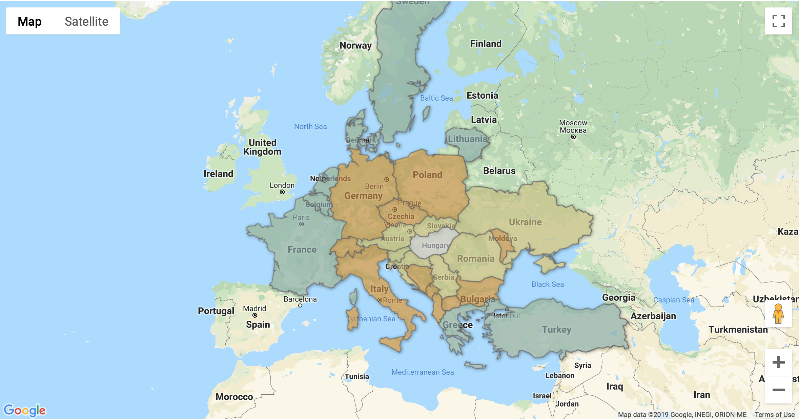

### Visualising countries as layers on a Google Map

First of all you need to get your own [Google Maps API key](https://developers.google.com/maps/documentation/javascript/get-api-key). Go get one and replace `<put-your-Google-Maps-API-key-here>` with it.

You need to get a web server to "host" the pages, so one is included as a Docker container.

Make sure that Docker Engine is running.

Then from the root of the project start the containerised Apache:

```shell
docker-compose up
```

Apache will pick up a basic `httpd.conf` from apache/conf.

Simply visit http://localhost and click on the HTML file.

The implementation uses the `World Country Boundaries.kml` Fusion Tables to retrieve the country boundary data.

The file is available at:

https://fusiontables.google.com/DataSource?docid=1N2LBk4JHwWpOY4d9fobIn27lfnZ5MDy-NoqqRpk#rows:id=1

Once loaded you need to "query" the database by including 2 letter country codes in the "WHERE" part of the "SELECT".

The selected countries will have a layer on top of them.

You can further colour code each country by "running" "styles" queries. See lines 20-24.

#### Sample map view



Tested on

* Docker Engine 18.09.2
* Apache/2.4.39
